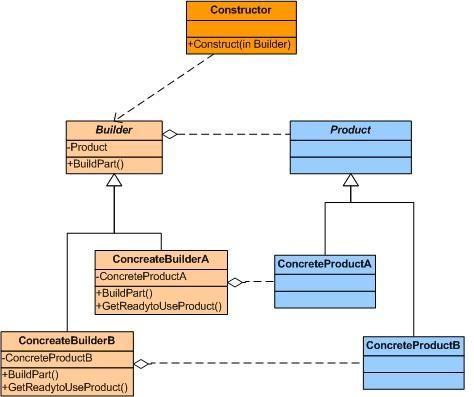

# Builder

_El patrón constructor es un patrón de diseño único que ayuda a construir objetos complejos usando objetos simples y utiliza un enfoque algorítmico. Este patrón de diseño entra en la categoría de patrón de creación. En este patrón de diseño, una clase constructora construye el objeto final en un procedimiento paso a paso. Este constructor es independiente de otros objetos._

## Ventajas del patrón Builder
- [x] Proporciona una clara separación y una capa única entre la construcción y la representación de un objeto específico creado por la clase.

- [x] Proporciona un mejor control sobre el proceso de construcción del patrón creado.

- [x] Es el escenario perfecto para cambiar la representación interna de los objetos.

## Image

## ¿Cómo implementar un patrón builder?
