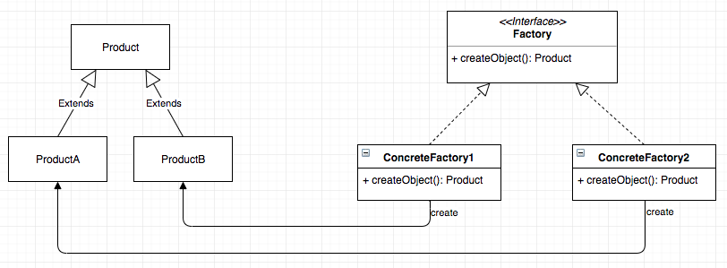

# Factory

_El patrón factory entra en la categoría de lista de patrones de creación. Es una de las mejores formas de crear un objeto. En el patron factory, los objetos se crean sin exponer la logica al cliente y se refieren al objeto recien creado utilizando una interfaz en comun._

_Los patrones factory se implementan en python utilizando el método factory. Cuando un usuario llama a un método como el que psamos en un string y el valor de retorno como un nuevo objeto se implementa a traves del metodo factory. El tipo de objeto utilizado es el metodo factory se determina por el string que se pasa a traves del metodo._

En el ejemplo, cada método incluye un objeto como parámetro, que se implementa a través del método factory

## Image

## ¿Cómo implementar un patrón de factory?
