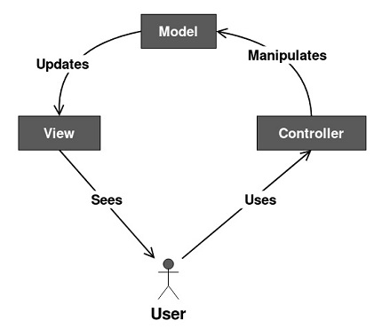

# MVC
Model View Controller is the most commonly used design pattern.

El modelo-vista-controlador es uno de los patrones de diseño mas utlizados por los desarrolladores, tiene tres partes claves:  

## Image

## Modelo

_Consiste en la logica de la aplicacion, o tambien conocida como la logica de negocio, que interactua con la base de datos_

## Vista

_La vista es el archivo HTML, que interactua con el usuario final, representa los datos del modelo al usuario_

## Controlador

_Actua como intermediario entre el modelo y la vista_
